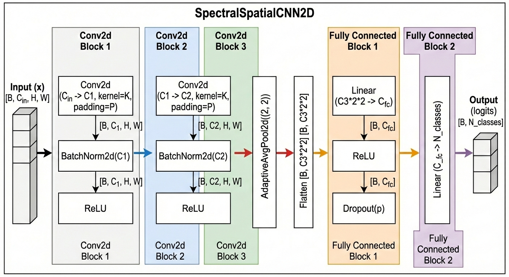

# Non-invasive diagnosis of phosphorus deficiency stress in common beans (*Phaseolus vulgaris* L.)
## An approach based on spectral fingerprinting and artificial intelligence

**Author:** John Mario Montoya Zapata  
**Degree:** Master's Thesis — Universidad Nacional de Colombia  
**Field:** Precision Agriculture · Hyperspectral Imaging · Machine Learning & Deep Learning  
**Status:** ✅ Approved (May 2026) — 20 jury observations addressed  

| Version | Date | Notes |
|---|---|---|
| 0.1.0 | 2025-04-14 | Initial development |
| 1.0.0 | 2026-01-22 | Thesis submission |
| 1.1.0 | 2026-05-12 | Post-jury corrections applied |
| 1.2.0 | 2026-05-14 | Repository reorganisation (uv, modular package, FastAPI stub) |

---

## Overview

This repository contains the complete codebase, data management structure, experiments,
and documentation for detecting **phosphorus (P) deficiency stress** in common bean
(*Phaseolus vulgaris* L.) using UAV-based **hyperspectral imagery** and ML/DL.

### Key result

The final **CNN-2D** model (spectro-spatial convolutional network on 5×5 pixel patches)
achieves **PR-AUC = 0.9635** on the spatially independent test set, substantially
outperforming all classical ML baselines (PR-AUC 0.79–0.82) and the spectral-only
CNN-1D (PR-AUC = 0.83).



---

## Table of contents

1. [Scientific contributions](#scientific-contributions)
2. [Repository structure](#repository-structure)
3. [Installation](#installation)
4. [Pipeline usage](#pipeline-usage)
5. [Data management and reproducibility](#data-management-and-reproducibility)
6. [Jury corrections (completed)](#jury-corrections-completed)
7. [License](#license)
8. [Contact](#contact)

---

## Scientific contributions

- **End-to-end HSI workflow** — hypercube preprocessing, NDVI-based vegetation masking,
  spectral band selection via SNR proxy + decorrelation, vegetation index computation.
- **Informed band selection** — 58 spectral bands selected from 363 original bands using
  SNR proxy and spectral decorrelation; 5 vegetation indices (NDVI, NDRE, CIgreen, PRI, PSRI).
- **Spatial train/val/test split** — 60 / 20 / 20% across parcel boundaries, preventing
  spatial leakage that would inflate performance estimates.
- **CNN-2D with spectro-spatial patches** — 5×5 patches capture local canopy texture,
  confirming that spatial context improves detection vs spectral-only approaches.
- **Robustness analysis** — per-genotype performance breakdown + two spectral ablation
  probes ruling out polygon-geometry memorisation as the source of high PR-AUC.
- **Vegetation index ablation** (jury correction C #17) — NDRE is the most informative
  individual index for the CNN-2D (ΔPR-AUC = 0.073); VI collectively contribute 5.5 pp
  (significant threshold ≥ 0.05).
- **Reproducible experimentation** — MLflow, Optuna, and DVC throughout.

---

## Repository structure

```
thesis/
├── spectralcrop/           # Source package (modular, production-ready)
│   ├── config/             #   paths.py, constants.py (locked hparams)
│   ├── data/               #   hypercube_processor.py, make_dataset.py
│   ├── evaluation/         #   metrics.py, confusion_matrices.py, feature_ablation.py
│   ├── features/           #   patches.py (CNN-2D), vegetation_indices.py, band_selection.py
│   ├── models/
│   │   ├── dl/             #   architectures.py, train.py, predict.py
│   │   └── ml/             #   predict.py (threshold finder)
│   ├── performance/        #   computational_cost.py
│   ├── utils/              #   path_manager.py
│   └── visualization/      #   visualize.py
├── app/                    # FastAPI inference API (stub, ready for deployment)
│   ├── routers/            #   health.py, inference.py
│   ├── schemas/            #   request.py, response.py
│   ├── services/           #   model_loader.py
│   └── Dockerfile.example
├── notebooks/              # 18 Jupyter notebooks (exploration → corrections)
├── data/                   # DVC-tracked (raw 9.5 GB, interim, processed, external)
├── models/                 # DVC-tracked model artefacts (20 files, ~77 MB)
├── reports/
│   ├── Trabajo Final John Montoya.docx  # ← Final thesis document
│   └── figures/            # Figures for thesis and jury responses
├── references/             # Papers and technical reports (DVC-tracked)
├── tests/                  # Smoke tests
├── docs/                   # DVC guides, cleanup reports
├── archive/                # Legacy files (requirements*.txt, setup.py, etc.)
├── pyproject.toml          # Dependency specification (uv)
├── uv.lock                 # Locked dependency graph
├── Makefile                # Common workflow targets
└── main.py                 # CLI orchestrator (typer)
```

---

## Installation

Requires **Python 3.12** and **[uv](https://docs.astral.sh/uv/)**.

```bash
git clone https://github.com/johnma96/thesis.git
cd thesis

# CPU-only (CI, PC A)
uv sync --extra pytorch-cpu --extra notebooks

# GPU — CUDA 12.6 (PC B: RTX 3050)
uv sync --extra pytorch-cu126 --extra notebooks

# Full development environment
make install-gpu   # or: make install  (CPU)
```

See [install.md](install.md) for DVC credentials and detailed instructions.

---

## Pipeline usage

```bash
# Pull data and models from DagsHub
make sync

# Retrain CNN-2D with locked hyperparameters
make train

# Evaluate on test set
make evaluate

# Full pipeline (train → evaluate)
make pipeline

# Lint and test
make lint
make test
```

Or directly via the CLI:

```bash
uv run python main.py --help
uv run python main.py train-cnn2d --use-locked-hparams
uv run python main.py evaluate --model cnn2d --split test
```

---

## Data management and reproducibility

All large data artefacts are versioned with **DVC** and stored on
**DagsHub** (`https://dagshub.com/johnma96/thesis`):

| DVC pointer | Content | Size |
|---|---|---|
| `data/raw.dvc` | Raw hyperspectral cube (ENVI), label polygons | ~9.5 GB |
| `data/interim.dvc` | Masked Zarr cube, band-selection CSVs, label TIF | ~200 MB |
| `data/processed.dvc` | Split TIFs, training-loss CSVs | ~5 MB |
| `models.dvc` | 20 model artefacts (weights + scalers) | ~77 MB |
| `reports/figures.dvc` | All figures | ~30 MB |
| `references/papers.dvc` | 90 academic papers | ~382 MB |

Experiment tracking: **MLflow** on DagsHub (`https://dagshub.com/johnma96/thesis.mlflow`).

Final CNN-2D registered as `bean_stress_classifier` v1 (Production),
run_id `61a3cc05f39d46f79f2e3fa3d29fae7f`.

---

## Jury corrections (completed)

All 20 observations by the jury (Manuel Mauricio Goez Mora, ITM, April 2026)
were addressed and the thesis was approved in May 2026.

| Category | Items | Status |
|---|---|---|
| A — Formatting / editing | 3 | ✅ |
| B — Written clarifications | 12 | ✅ |
| C — Additional analysis | 4 | ✅ |
| D — Methodological robustness (CNN-2D) | 1 (with 3 sub-tasks) | ✅ |

See `docs/thesis_corrections/` for the original jury PDF.

---

## Reproducibility statement

- All random seeds fixed at **42** throughout.
- Spatial split is deterministic (defined once in `notebooks/302-jmmz-spatial-split.ipynb`,
  stored as `data/processed/splits/by_plot_split_id_binary.tif`).
- Final CNN-2D hyperparameters locked in `spectralcrop/config/constants.py`
  and traceable to MLflow run `61a3cc05f39d46f79f2e3fa3d29fae7f`.
- `uv.lock` pins all 340 transitive dependencies to exact versions.
- DVC hashes guarantee that the exact data artefacts used in the thesis
  are retrieved when running `dvc pull`.

---

## License

- **Code:** MIT — see [LICENSE](LICENSE)
- **Data:** All Rights Reserved — see [DATA_LICENSE.md](DATA_LICENSE.md)

---

## Contact

**John Mario Montoya Zapata**  
Data Scientist · MSc. Universidad Nacional de Colombia

🌐 [johnmontoya.vercel.app](https://johnmontoya.vercel.app/) — portfolio  
📧 jmmontoyaz@unal.edu.co · jmmontoyaz13@gmail.com  
🐙 [github.com/johnma96](https://github.com/johnma96)
